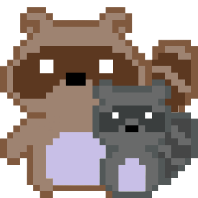

<div style="text-align: center;">
    
</div>

# 🦝 Trash Panda: A Maze Adventure

Trash Panda is an exciting maze game where you guide a nocturnal raccoon through various challenges, including increasing maze complexity, nighttime navigation, and avoiding an angry neighbor. The goal is to complete all levels successfully and reunite with your raccoon family!

---
## ✨ Features
### 🤯 Gameplay Challenges
1. **Normal Mode**: Navigate progressively larger and more complex mazes.
2. **Night Mode**: Experience the maze blacked out with only a halo of light around the Trash Panda.
3. **Angry Neighbor Mode**: Dodge projectiles launched by an angry neighbor located at the top center of the map.
4. **Composite Mode**: Face the ultimate challenge where night mode and angry neighbor mode are combined.

### 🕹️Controls
- **W-A-S-D Control**: Move the Trash Panda through the maze.

### 💾 Resumable Progress
- If the game is interrupted or the player dies, the game allows you to resume from the last level you reached.

---
## 🥅 Objective
Guide the Trash Panda through all stages of the maze while overcoming unique obstacles and challenges. Successfully completing all levels ensures the Trash Panda can return to its family.

---
## 🔧 Installation and Setup

1. Clone the Repository:
2. Mark src folder as Sources Root
3. Run TrashPandaGame.java
---

## ️️🗃️Project Structure

```plaintext
TrashPandaGame/
├── src
│   ├── images/             # Game assets
│   └── TrashPanda/         # Source code for game logic
├── test/                   # Unit tests for the game
├── checkstyle/             # Checkstyle configuration
├── target/                 # Compiled output and build files
└── README.md               # Project documentation
```

---

## 🧾 Classes Overview

- **TrashPandaGame**: Entry point and driver of the game.
- **ImageLoader**: Loads images used in the game.
- **Game**: Manages overall game logic.
- **Player**: Handles player attributes and movement.
- **Maze**: Generates and manages maze structures.
- **LevelManager**: Handles progression between levels.
- **Mode**: Parent class for game modes.
  - **NormalMode**
  - **NightMode**
  - **AngryNeighborMode**
  - **CompositeMode**

- **Neighbor**: Shoots projectiles towards the maze at random speeds and directions in Angry Neighbor and Composite Mode.
- **Projectile**: Manages the behavior of projectiles in Angry Neighbor and Composite Mode.
    
---

## 🧪 Testing
Unit tests are included for all major components to ensure robust functionality in "tests" folder.

---

## 🔮 Future Enhancements
- Items like flashlight or shield to assist game play
- Option to start new game or load old game
- Raccoon selection
- Sound effects
